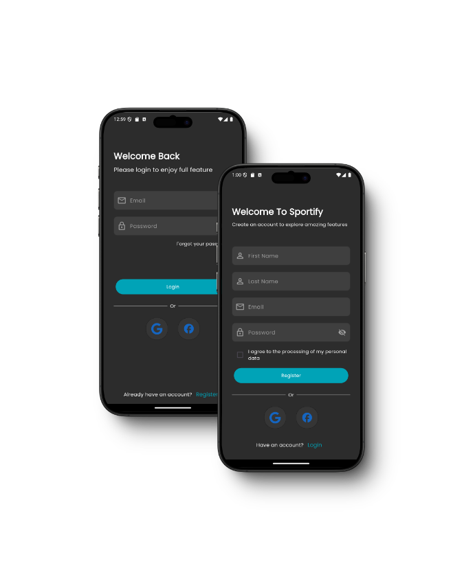
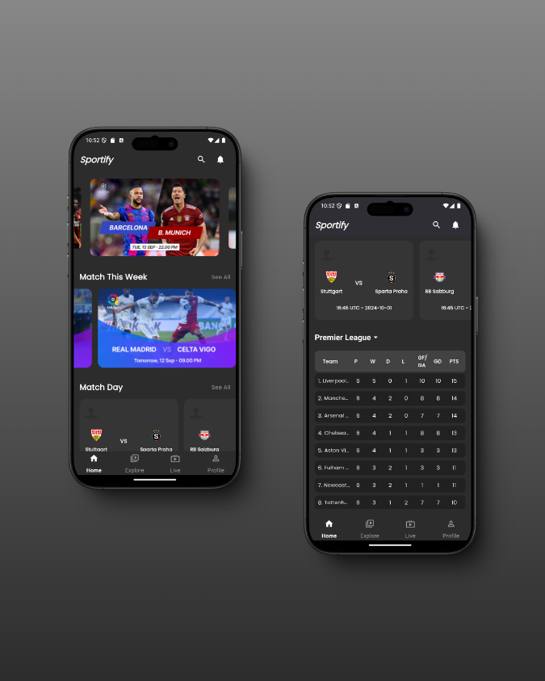
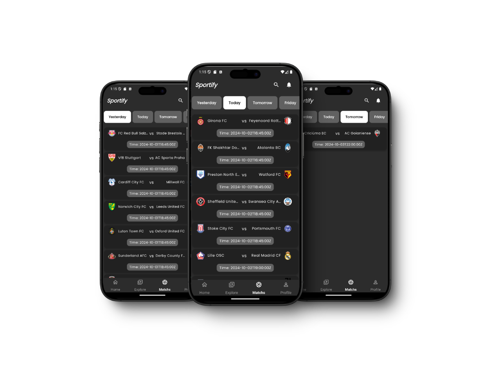

# Sportify

**Sportify** is a mobile application developed as part of a final project for the Ministry of Communications and Information Technology. The app is designed to enhance user engagement in sports by providing real-time information, league standings, match updates, and personalized content in an intuitive and seamless interface.

## Screenshots

### Onboarding Screens


### Authentication Screens



### Home Screen



<!-- ### Match Table Screen
 -->

### Profile Screen


### Explore Screen


### Favorite Team Screen


## Features

- **User-Friendly Onboarding**: A simple, clear, and engaging onboarding experience to guide users through the app's main features.
- **Secure Authentication**: Register and log in with secure credentials, ensuring user data is protected.
- **Live Match Updates**: Stay updated with real-time scores and match schedules for various leagues.
- **League Standings**: View up-to-date league tables, including your favorite teams.
- **Favorite Teams**: Follow your favorite teams and get personalized content, updates, and match notifications.
- **Responsive UI**: A highly responsive design that adapts to different screen sizes, ensuring an optimal experience across devices.

## Installation

1. Clone the repository:
   ```bash
   git clone https://github.com/yourusername/sportify.git
   ```
